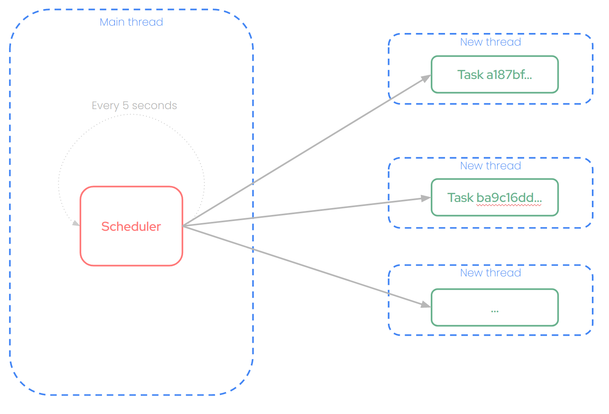

# Concepts

`@perseid/jobs` is a job scheduler that allows to run complex automations and flows, optionally on a recurrent basis, on dedicated processes or machines. It is a good complement to API servers, which primary goal is to handle huge loads of HTTP requests as fast as possible; computationally-intensive tasks can be delegated to the job scheduler to keep these servers free.

:::tip Note
Under the hood, `@perseid/jobs` is just an implementation of `@perseid/server`.
:::

Here is how it works:

## Job

A job is a specific algorithm to execute, implemented in a standalone script file. For instance, a job can be:
- Sending notifications to customers
- Creating databases snapshots
- Permantently deleting items that match specific conditions from database every month
- Processing logs in batch to extract relevant insights
- ...

## Task

A task is an execution of that job in its own thread, at a specific moment, with given arguments. A task can be run periodically (e.g. every 10 seconds), after another task, or just once.

## Main thread

The job scheduler periodically performs several operations:
- It periodically checks for any pending task that meets some conditions to be run right now.
- If a tasks meets these requirements, the scheduler automatically starts a new thread to run that task.
- Once a task has successfully ended, it is automatically marked as completed, and its log file is uploaded on a persistent bucket.

## Exit codes

Once run, a task can exit three different ways:
- As soon as the job script has finished and all promises have resolved (exit code 0)
- If an error occurs during the script, and is not properly caught (exit code 1)
- If you manually cancel the task execution, by calling process.exit(100)

## Execution time

A task cannot run longer than the maximum execution time defined in its related job. Passed that duration, the job scheduler will automatically kill the task's process, and the task will be marked as failed.

## Recurring tasks

Recurring tasks are tasks that are executed periodically, either at a specific time (e.g. every hour, every day, and such, using startAt and recurrence fields), or after another recurring task has completed (using startAfter field). Such tasks are especially useful when you want to perform operations on a regular basis, like a CRON. When the next recurring task is scheduled after a task successfully ends, a new information is added to the next task's metadata: lastCompletedAt.This field will contain the date of the last successfull execution for this recurring task. It can be especially useful to resume operations back to where they stopped (if the job scheduler did'nt run for a long time, for instance).

## Logging system

Each running task is allocated its own logs file (using the excellent pino-js library). Everything you log using logger.debug, logger.error and such will end-up in that file. This system has a few advantages:
- Logs coming from running tasks do not pollute main thread's logs stream
- These logs can be then uploaded onto a persistent storage system, for audits and troubleshooting

## Scaling the job scheduler

You can run several job schedulers at the same time, to handle massive workloads. Several mechanisms are implemented to make that scaling possible:
- **Load balancing:** each task will be assign to a specific job scheduler. Once a task is assigned to an instance, none of the others can run it.
- **Automatic failover:** if, for some reason, your job scheduler crashes during a task's execution, the next job scheduler will automatically mark the task as failed 1 minute after the maximum execution time.
- **Slots:** executing a job may consume very different amount of resource depending on the typology. For instance, images compression will be quite consuming, whereas automatic emails followups are very lightweight. Hence, you might want to provision different machines with different power to run these tasks. The slots concept is exactly meant for this purpose : allow some instances to run specific tasks, and not others. The slots field in a job represents the amount of resources you want to allocate for that job. It is completely arbitrary (you can see this number as the amount of vCPU you need), but the bigger means the heavier the job is to execute. On the other side, availableSlots determines how many slots are available for this instance. An instance having 512 slots won't be able to execute a job requiring 1024 slots. But an instance having 1024 slots will be able to run 2 jobs requiring 512 slots at a time. As soon as a task is launched on an instance, the number of slots disminuishes accordingly. On task's completion or failure, the related slots are freed-up.

